# CSE-472-Project

<!--# 28-jan-23

- installed docker desktop from here : https://www.docker.com/
- after running docker desktop, checked out following articles
     - https://medium.com/techanic/docker-containers-ipc-using-sockets-part-1-2ee90885602c
     - https://medium.com/techanic/docker-containers-ipc-using-sockets-part-2-834e8ea00768
    articles can be found in the resources/docker test directory.
- check out running docker images with the command `docker images`
- if there is no 'my_ipc_server' container running, `docker build -t my_ipc_server .` otherwise go to next step.
- to start the container `docker run -p 9898:9898 my_ipc_server`
- open another terminal and execute `python ipc_client.py`

some handy docker commands :
- docker ps (to see running containers)
- docker stop [container]
- docker restart [container]
- sudo aa-remove-unknown (if docker container refuses to stop)
- 
  To copy files from host machine to a docker container :
- docker cp /path/to/local/file.txt container_name:/path/to/container/file.txt
- 
  To check files inside container
- docker exec -it container_name /bin/bash
    cd /path/to/container
    ls

# 17-feb-23

Implementing Secure-Sum Protocol
================================

Simulated 10 computers (container names : client1...client10) and a mediator (container name : server) using docker containers.

To run a bash script, first set permission : `chmod +x script_name.sh`, then run `./script_name.sh`. Run the following scripts in order.

- docker-script.sh

creates a network of docker containers. Creates all the clients and mediator and connects them in a bridge network named mynetwork. To inspect the network you can run the following command `docker network inspect mynetwork`

- docker-script2.sh

Copies the rsa implementation and a script to generate private and public keys to each machine.

- docker-script3.sh

Installs necessary libraries to run provided python scripts in each machine.

- docker-script4.sh

Generates private and public key for every single machine locally. Then sends all public keys to all machines. So every single machine has all public keys, but only own private key. To check, do the following :

`docker exec -it <container_name> sh`

`ls`

`exit`

Again, container names are : client1...client10 and server.

After running above four scripts, no need to rerun them ever again. After the first time, just run the "docker-restart-containers.sh" script.

Next work : Put individual data files into container of each party. Then write a script so that each party shards the data into 4 parts, encrypts the shards in the following order of encryption key -> public0 ... public10. (public0 is server's own public key) Then sends encrypted shards to server. Upon receiving, server shuffles all data segments then sends the entire data to client10. client10 decrypts and sends to client9. client9 decrypts and sends to client8.. and so forth, until client1 sends data back to server, then server decrypts data with own private key.

# 20-feb-23

added encryption decryption methods in the following files
-phase_2.py
-phase_3.py
-docker-script5.sh
-docker-script6.sh

Run in the following order :
1. docker-restart-containers.sh
2. docker-script2.sh
3. docker-script3.sh
4. docker-script4.sh [key generation]
5. docker-script5.sh [encryption] #causes error
6. docker-script6.sh [decryption]
  
* issues that need to be fixed : public key pickle file is somehow found empty in the clients, so cannot be encrypted

# 21-feb-23

Ignore above instructions.

First run docker-stop-containers.sh.
Then run :
`docker rm server`
`docker rm client1`
`docker rm client2`
`docker rm client3`

Run following commands
- `chmod +x build.sh`
- `chmod +x run.sh`
- ./build.sh [run only once]
- ./run.sh [run every time after opening project]

run.sh contains entire secure sum protocol performed on test.txt files on each host. Have to modify this for ML.

 # list of work :
- create test_parkinsons.csv and send to each client
- complete accuracy function
- send only logreg.py to each client again
- run inference with existing params, note down accuracy for trusted distributed
- implement with secure sum 

 on train_parkinsons and test_parkinsons :
==============================================
Distributed Trusted with 10 epochs -
client 1,2,3 shows same score (makes sense as parameters (w), x_test and y_test are same)
Accuracy :  0.7692307692307693
Precision :  0.7692307692307693
Recall :  1.0

Distributed Untrusted with 10 epochs - 
Accuracy :  0.7692307692307693
Precision :  0.7692307692307693
Recall :  1.0

Centralized Trusted with 10 epochs - 
Accuracy  0.7692307692307693
Recall score  1.0
Precision score  0.7692307692307693 -->

<!-- <embed src="resources/1705037_1705051_ProjectProposal.pdf"
 type="application/pdf"> -->
## Problem Definition
A Secure Sum Protocol for Privacy Preserving ML

When multiple parties, each owning a privacy-sensitive dataset, would like to collectively perform analytics on the union of the datasets - problems may arise regarding data privacy and security concerns of each individual party. Current commercial solutions require each party to share their raw data or local aggregates with a trusted third party or a mediator under an appropriate confidential agreement, and have the mediator compute and share the results. 
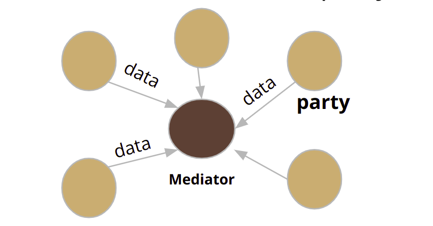

But what if the mediator is not trustworthy? 

To address this problem, we are introducing a generalized framework that enables training of machine learning models on multi-party, distributed data in a privacy-preserving manner. The proposed framework assumes an untrusted mediator. Under our framework, each party shares only encrypted local results, and then the mediator aggregates these results to obtain the global result.

**Our main contributions would be the following :**

- Developing two secure gradient descent algorithms - one for horizontally partitioned data and another for vertically partitioned data. They are generic and apply to a wide class of machine learning problems such as regression, classification and clustering.

- Implementing and testing the proposed solution for three analytic use-cases : linear regression, logistic regression and support vector machine, using both real-world and synthetic datasets.

- Evaluating the performance of the proposed approach in terms of accuracy of the resulting model, communication cost, and latency, and compare it with two baseline approaches - centralized and distributed trusted mediator.

## Link to the paper
- Shagufta Mehnaz, Gowtham Bellala, and Elisa Bertino. 2017. A Secure Sum Protocol and Its Application to Privacy-preserving Multi-party Analytics. In Proceedings of SACMAT’17, June 21–23, 2017, Indianapolis, IN, USA.
DOI: http://dx.doi.org/10.1145/3078861.3078869

## Proposed solution (architecture)
- **Protocol Description**
	The following is the list of our assumptions on the parties and the mediator:
    1. Each party and the mediator has a secret key and a public key. The public keys of all parties and the mediator are known to all entities.

    2. The encryption and decryption operations performed by the parties always follow a particular order.

The protocol consists of three stages: **input preparation, anonymization and sum calculation**. The first phase involves the preparation of input values by each party, which includes dividing the values into segments and recursively encrypting them using the public keys of the mediator and the N parties. In the second phase, the Nth party performs decryption and reshuffling of the segments, passing them on to the N-1th party, and so on, until the 1st party. This results in the anonymization of the segments, with only one layer of encryption remaining with the mediator's key. Finally, in the third phase, the mediator decrypts the segments using their secret key and calculates the sum.

The protocol is depicted in the following diagrams (Fig 1 and 2)

Let’s assume, there are i = 1,2,3, …, N parties. Available data to each party is Si.

  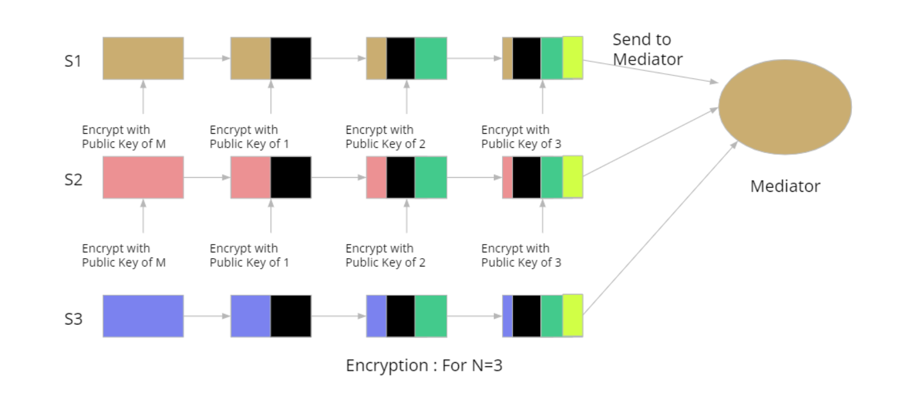
   
  <em>Fig 1 : Step 1- Encryption with Elgamal Cryptosystem</em>

  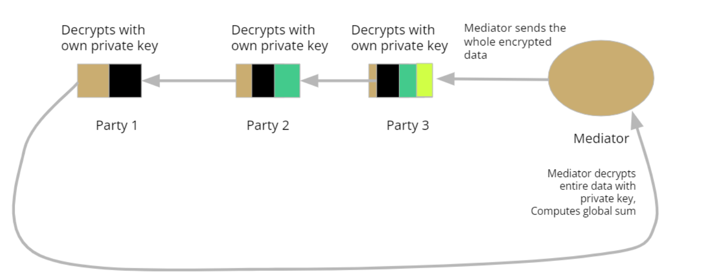
   
  <em>Fig 2 : Step 2- Decryption</em>

- **Applying Protocol to Gradient Descent Algorithm**
Most machine learning algorithms can be formulated as an optimization problem, with the goal of minimizing a cost (or objective) function. Also, most optimization problems rely on gradient descent.

  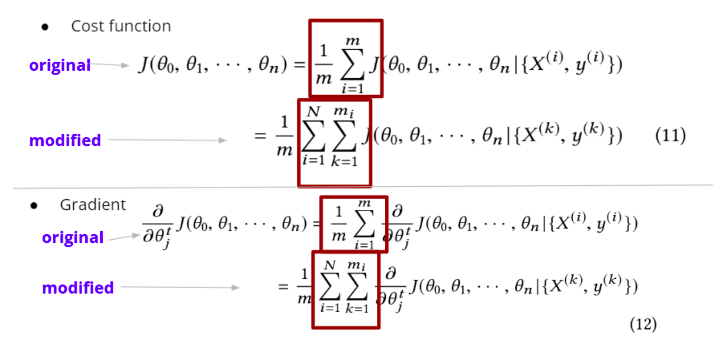
   
  <em>Fig 3 : Modifications in Gradient Descent to Implement Secure Sum</em>

Note that the inner summation in each of those equations denote computations that are based on data belonging to a single party, and thus can be completely evaluated by the
party. On the other hand, the outer summation involves data across parties, and thus this summation should be computed in a secure, privacy-preserving manner. Irrespective of the machine learning algorithm and its cost function, the outer summation always involves a simple sum over N scalars, which can be computed using a secure sum protocol.

## Implementation
1. Created a distributed systems scenario with Docker.
     - 3 computers (container names : client1, client2, client3)
     -  A mediator (container name : server)
     -  All containers are connected via a bridge network.
2. Implemented **secure sum protocol** for these containers. For encryption algorithm, we used **RSA cryptosystem**.
3. Implemented logistic regression for three scenarios :
      - **Centralized Trusted** : Regular logistic regression on entire train set, without any partitioning.
      - **Distributed Trusted** : Logistic regression on nodes on which the dataset is horizontally partitioned. Here, each node computes gradients locally and sends them to the server unencrypted. After receiving all the gradients, the server updates the weights and sends them back to each node.
      - **Distributed Untrusted** : Similar to distributed trusted, here each of the nodes has a horizontal partition of the dataset. Each node computes gradients locally and sends to the server after encrypting them, following the secure sum protocol. After receiving all the gradients, the server updates the weights and sends them back to each node.
4. Trained and tested logistic regression for each scenario, using the dataset SUSY. A total of 10000 entries of the shuffled dataset was taken, and the train and test set were generated by an 80-20 split. The hyperparameters of the model were kept the same across scenarios. 
5. Computed **accuracy, precision, recall** and **latency** (time to train and generate predictions) for all three scenarios.

## Steps To Run The Simulation

1. Install Docker on your Ubuntu machine. To install Docker on Ubuntu, you can follow these steps:

- Update the apt package index:

      `sudo apt-get update`

- Install the dependencies necessary to use Docker:

      `sudo apt-get install apt-transport-https ca-certificates curl gnupg lsb-release`

- Add the Docker GPG key:

      `curl -fsSL https://download.docker.com/linux/ubuntu/gpg | sudo gpg --dearmor -o /usr/share/keyrings/docker-archive-keyring.gpg`

- Add the Docker repository to APT sources:

      `echo "deb [arch=amd64 signed-by=/usr/share/keyrings/docker-archive-keyring.gpg] https://download.docker.com/linux/ubuntu $(lsb_release -cs) stable" | sudo tee /etc/apt/sources.list.d/docker.list > /dev/null`

- Update the apt package index again:

      `sudo apt-get update`

- Install Docker:

      `sudo apt-get install docker-ce docker-ce-cli 
- Verify that Docker is installed correctly by running the "hello-world" container:

      `sudo docker run hello-world`
- This should download and run a small Docker container, and output a message that says "Hello from Docker!" if everything is working correctly.

- Note: You may need to run some of these commands with sudo or as a privileged user, depending on your system configuration.

 By default, running Docker commands requires sudo privileges. To run Docker commands without using sudo, you can add your user to the docker group, which grants permission to manage Docker as a non-root user.

      To add your user to the docker group, follow these steps:

      Open a terminal window and enter the following command to add your user to the docker group:

      `sudo usermod -aG docker ${USER}`
      Replace ${USER} with your username.

      To apply the group membership changes, log out and back in, or run the following command:

      `newgrp docker`
      This command refreshes your group membership without requiring a log out and back in.

      Verify that you can run Docker commands without sudo by running the "hello-world" container:

      `docker run hello-world`

      If everything is working correctly, you should see output similar to this:

      `Hello from Docker!`

      This message shows that your installation appears to be working correctly.

2. Run [build.sh](scripts/build.sh) to create the environment. 
   
        chmod +x build.sh
        ./build.sh
  You only need to do this once.

3. Run the following commands to simulate each three scenarios :
   
        python3 centralized_trusted.py

        ./distributed-trusted.sh
        
        ./distributed-untrusted.sh

## Description Of Implementation

### Building the environment
- [build.sh](scripts/build.sh)
  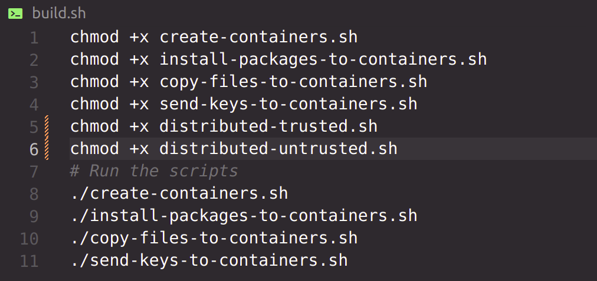
  | ---- [create-containers.sh](scripts/create-containers.sh)
  
  | ---- [install-packages-to-containers.sh](scripts/install-packages-to-containers.sh)
  
  | ---- [copy-files-to-containers.sh](scripts/copy-files-to-containers.sh)
  
  sends all the scripts needed to run locally on each computer, such as rsa implementation, logistic regression etc.
  
  | ---- [send-keys-to-containers.sh](scripts/send-keys-to-containers.sh)

  Generates private and public key of each container and sends the public keys to every container.

  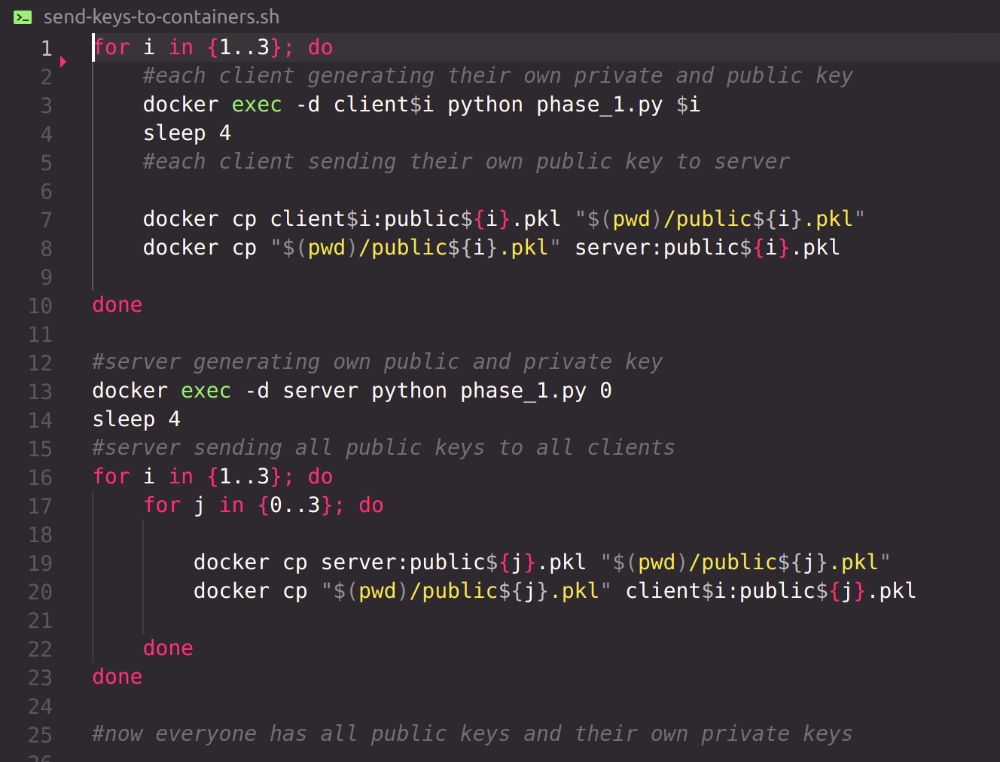
  -    | ----------------- [phase_1.py](scripts/phase_1.py)
      generates private and public key of each client and server and then stores them in pickle files locally.

Now everyone has all necessary local scripts, all public keys and their own private keys.

### Scenario : Centralized Trusted
- [centralized_trusted.py](scripts/centralized_trusted.py)
    Basic logistic regression performed on the entire dataset, on a central system, without any partitioning.

### Scenario : Distributed Trusted
[distributed-trusted.sh](scripts/distributed-trusted.sh)

  |-----[logreg.py](scripts/logreg.py)
  
  |-----[logreg_client.py](scripts/logreg_client.py)
  
  |-----[logreg_server.py](scripts/logreg_server.py)
  
  |-----[logreg_client_inference.py](scripts/logreg_client_inference.py)

  Restart containers if needed:
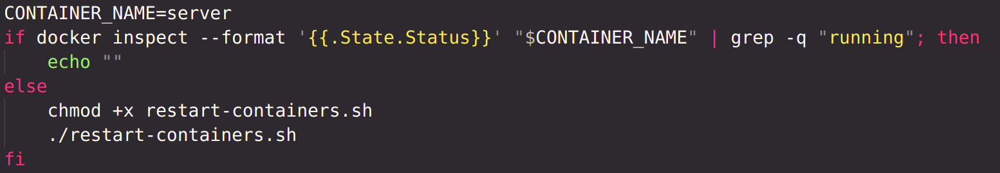
  Remove any previous loss, gradient or parameters file:
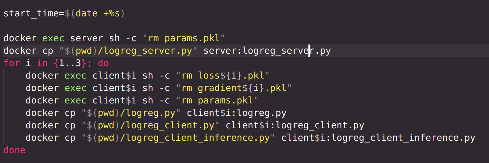
  For a certain number of epochs, run [logreg_client.py](scripts/logreg_client.py) which loads previously saved model, runs it for one epoch, saves loss and gradient into files, saves the model. Then, the loss and gradient files are sent to server using netcat. Until they reach the server, the file is resent over and over.
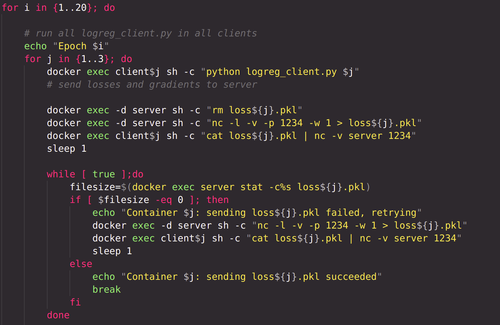
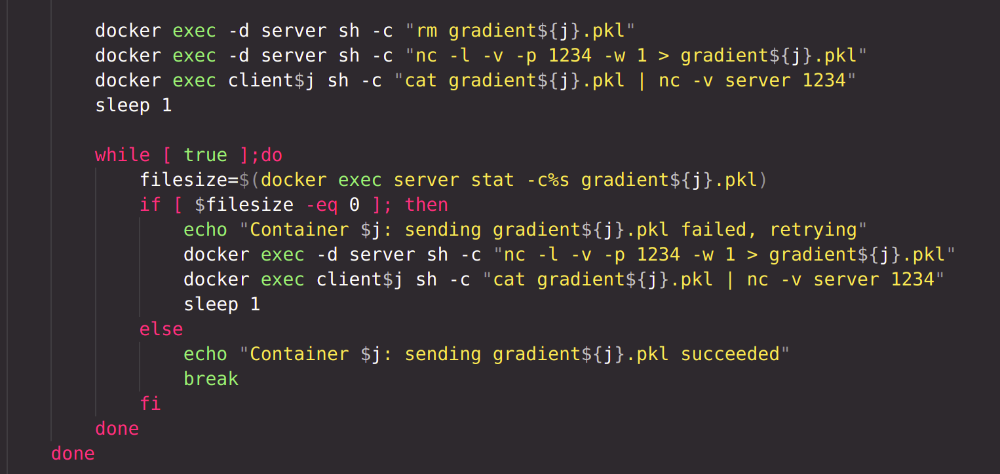

 In the server, [logreg_server.py](scripts/logreg_server.py) is run, which aggregates all the losses and gradients received from each client, generates weights of the model, stores them in file 'params.pkl'. The file is then sent to all clients.
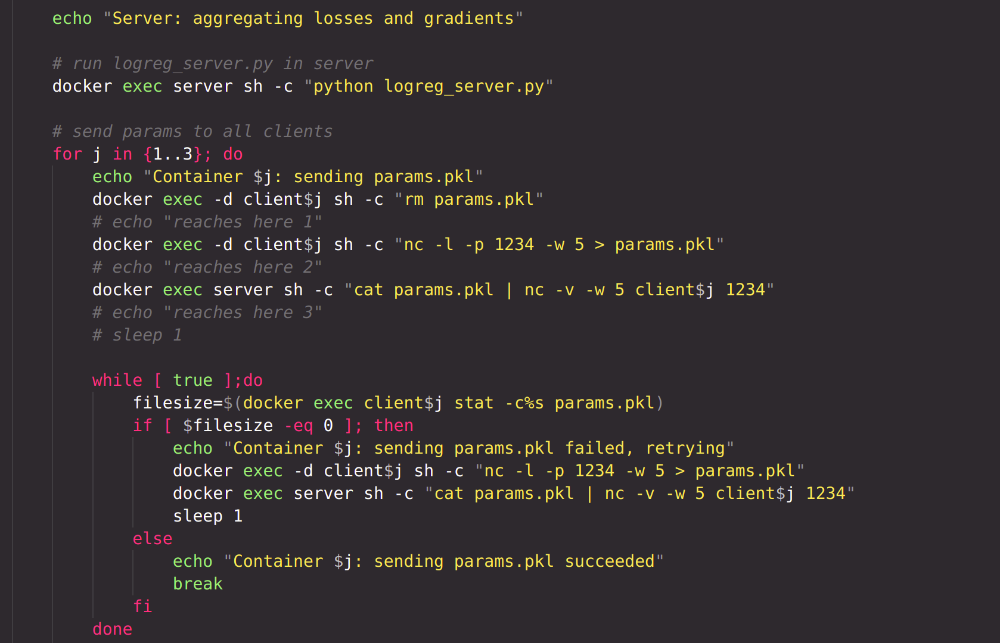

 Finally, after the model has been trained for specified epochs, the [logreg_client_inference.py](scripts/logreg_client_inference.py) file is run on each client locally. Prediction on the test set is generated in each client, and metrics are calculated.
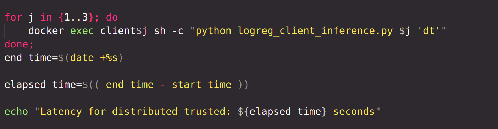

### Scenario : Distributed Untrusted
[distributed-untrusted.sh](scripts/distributed-untrusted.sh)

|-----[logreg.py](scripts/logreg.py)

|-----[logreg_client.py](scripts/logreg_client.py)

|-----[logreg_server.py](scripts/logreg_server.py)

|-----[logreg_client_inference.py](scripts/logreg_client_inference.py)

|-----[run.sh](scripts/run.sh)

  - |-----[encryption.sh](scripts/encryption.sh)
    - |-----[phase_2.py](scripts/phase_2.py)
    - |-----[rsa.py](scripts/rsa.py)
  - |-----[decryption.sh](scripts/decryption.sh)
    - |-----[phase_3.py](scripts/phase_3.py)
    - |-----[phase_4.py](scripts/phase_4.py)
  
The distributed untrusted scenario is similar to the trusted scenario, except now the losses and gradients are sent from each client to the server following the secure sum protocol. The secure sum protocol is implemented in the [run.sh](scripts/run.sh) script. The name of the file that has to be sent is provided as a command line argument to this script.

  
   
  <em>distributed-untrusted.sh</em>

  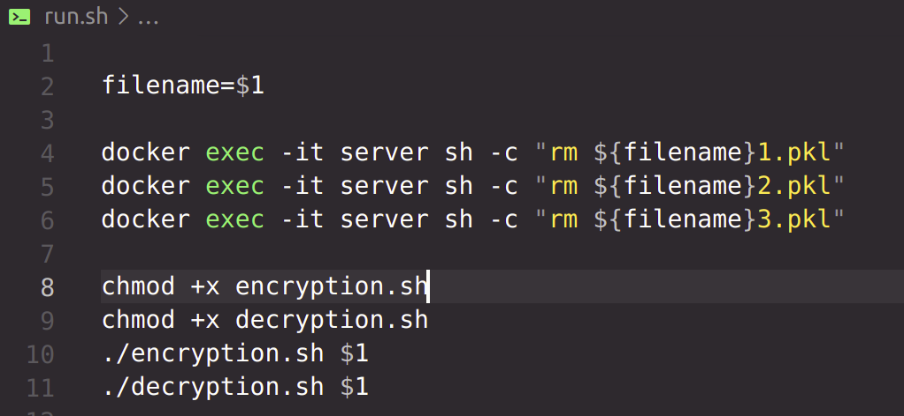
   
  <em>run.sh</em>

Each client encrypting local file respectively with public keys of client1, client2, client3 and server. Now the local file has 4 layers of encryption. Each encrypted local file is then sent to server.

  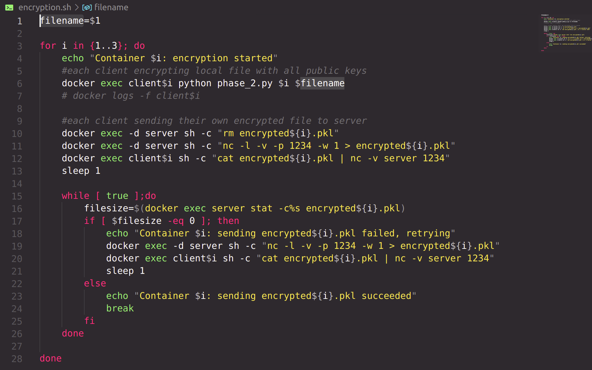
   
  <em>encryption.sh</em>

The process of multiple-layer encryption with RSA cryptosystem is implemented in the phase_2.py script.

  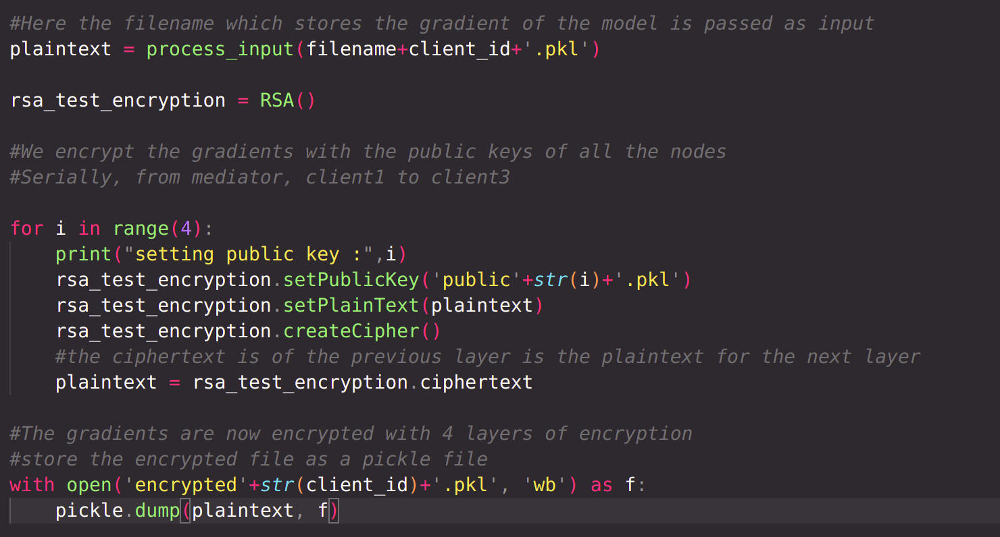
   
  <em>phase_2.py</em>

All encrypted files are now at the server. According to the protocol, the server will now send all the encrypted files to Party n. Party n will decrypt all files with it's own private key, stripping off one layer of encryption from all files. Then Party n will send all files to Party n-1, which will perform the same operations. Finally, Party 1 will send the files to server, which will decrypt all files with own private key and reconstruct the files.

  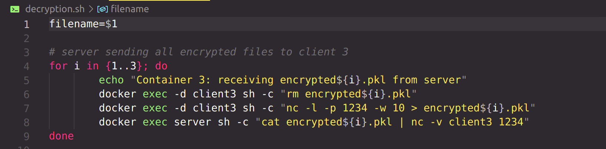
   
  <em>decryption.sh</em>

  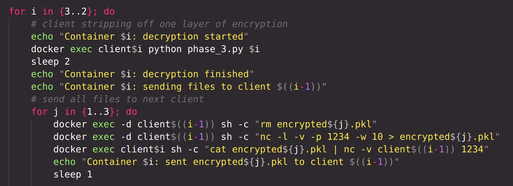
   
  <em>decryption.sh</em>

  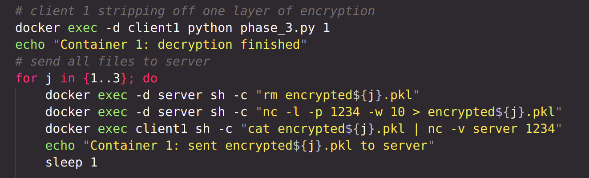
   
  <em>decryption.sh</em>

  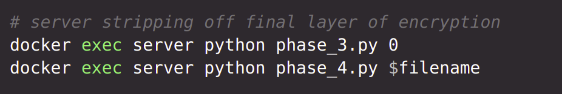
   
  <em>decryption.sh</em>

stripping off one layer of encryption from all files :

  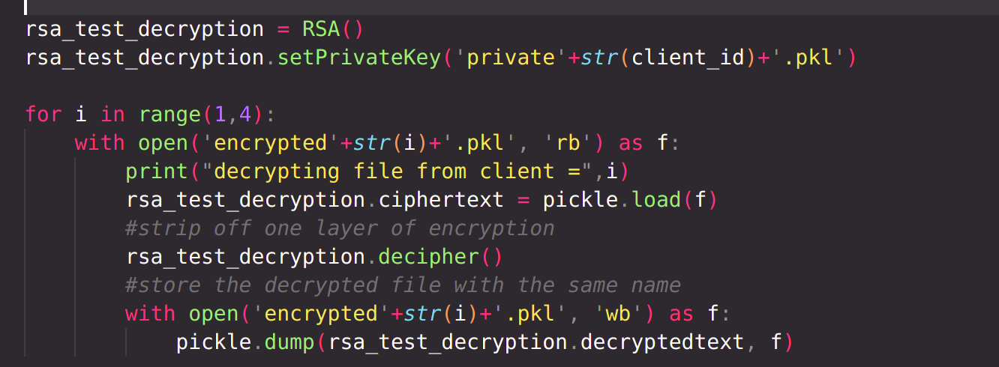
   
  <em>phase_3.py</em>

reconstruct the files :

  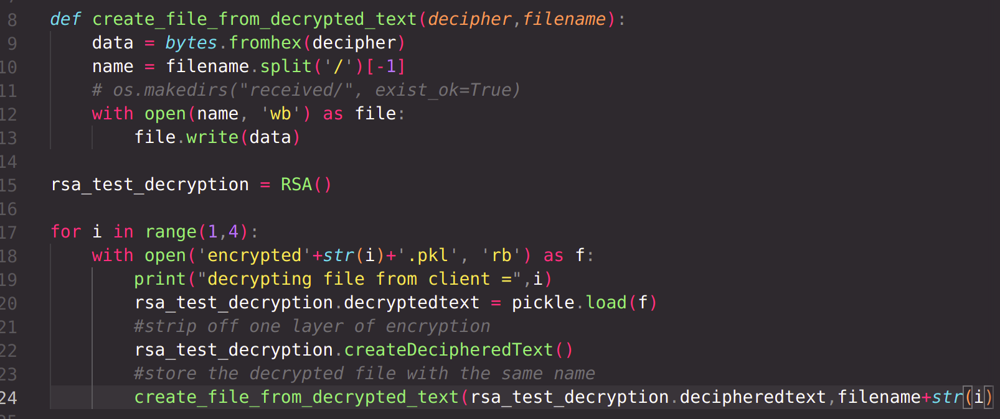
   
  <em>phase_4.py</em>

## Results
### Dataset For Classification: [SUSY Dataset](https://archive.ics.uci.edu/ml/datasets/SUSY)
#### Dataset Description :
A classification dataset to distinguish between a signal process which produces supersymmetric particles and a background process which does not.
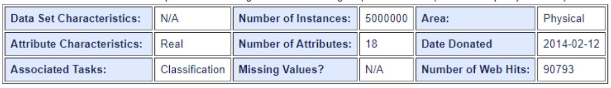

**Train set : 10000
Test set : 2000**

### Dataset For Regression: [Bike Sharing Dataset](https://archive.ics.uci.edu/ml/datasets/bike+sharing+dataset)
#### Dataset Description :
This dataset contains the hourly and daily count of rental bikes between years 2011 and 2012 in Capital bikeshare system with the corresponding weather and seasonal information.

<!-- **Centralized Trusted with 20 epochs -**
- Accuracy : 0.6565

- Precision : 0.8303571428571429

- Recall : 0.3069306930693069

- Latency: 0.22549176216125488 seconds

**Distributed : Client 1,2,3 shows same score (makes sense as parameters (w), x_test and y_test are same)**

**Distributed Trusted with 20 epochs -**
- Accuracy :  0.558

- Precision :  0.5092387287509239

- Recall :  0.757975797579758

- Latency : 737 seconds

**Distributed Untrusted with 20 epochs -**
- Accuracy :  0.5775

- Precision :  0.5594795539033457

- Recall :  0.3311331133113311

- Latency : 6439 seconds -->

### Logistic Regression
**Centralized Trusted with 10 epochs -**
- Accuracy  0.6335
- Recall score  0.7117711771177118
- Precision score  0.5787119856887298
- Latency on centralized trusted: 0.20304107666015625

**Distributed Trusted with 10 epochs -**
- Accuracy :  0.636
- Precision :  0.8428571428571429
- Recall :  0.12981298129812982
- Latency for distributed trusted: 361 seconds

**Distributed Untrusted with 10 epochs -**
- Accuracy :  0.636
- Precision :  0.844106463878327
- Recall :  0.24422442244224424
- Latency for distributed untrusted: 3174 seconds

### Support Vector Machine
**Centralized Trusted with 10 epochs -**
- Accuracy  0.4545
- Recall score  1.0
- Precision score  0.4545
- Latency on centralized trusted: 1.637641429901123

**Distributed Trusted with 10 epochs -**
- Accuracy :  0.4545
- Precision :  0.4545
- Recall :  1.0
- Latency for distributed trusted: 593 seconds

**Distributed Untrusted with 10 epochs -**
- Accuracy :  0.4545
- Precision :  0.4545
- Recall :  1.0
- Latency for distributed untrusted: 4833 seconds

### Linear Regression
**Centralized Trusted with 10 epochs -**
- R2: 0.6006615916518654
- MSE: 0.02731315070372643
- MAE: 0.13545571389229752
- RMSE: 0.165266907467062
- Latency on centralized trusted: 0.06763219833374023

**Distributed Trusted with 10 epochs -**
- R2: 0.5996337293159302
- MSE: 0.02738345237843939
- MAE: 0.13640264196804466
- RMSE: 0.16547946210463518
- Latency for distributed trusted: 601 seconds

**Distributed Untrusted with 10 epochs -**
- R2: 0.5996337293159302
- MSE: 0.02738345237843939
- MAE: 0.13640264196804466
- RMSE: 0.16547946210463518
- Latency for distributed untrusted: 4828 seconds

